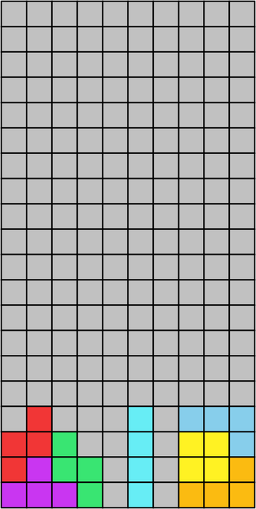
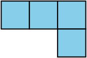
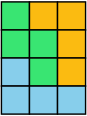

# Examples
<table>
<tr><th>tetrisviz</th><th>svg</th><th>pikchr</th></tr>
<tr>
<td><pre>
+board 10x20

-r---t-bbb
rrg--t-yyb
rpgg-t-yyo
pppg-t-ooo

</pre></td>
<td></td>
<td><pre>
boxwid = 0.5cm
boxht = boxwid
thickness = 0.01
$currLine = 1
define next {
  box invis at (-boxwid, -boxwid*$currLine)
  $currLine = $currLine + 1
}
define $e { box fill 0xc1c1c1 }
define $r { box fill 0xf13636 }
define $t { box fill 0x67edf5 }
define $b { box fill skyblue }
define $g { box fill 0x39e572 }
define $y { box fill 0xfff223 }
define $p { box fill 0xc936f1 }
define $o { box fill 0xfbbb11 }

$e;$e;$e;$e;$e;$e;$e;$e;$e;$e;next;
$e;$e;$e;$e;$e;$e;$e;$e;$e;$e;next;
$e;$e;$e;$e;$e;$e;$e;$e;$e;$e;next;
$e;$e;$e;$e;$e;$e;$e;$e;$e;$e;next;
$e;$e;$e;$e;$e;$e;$e;$e;$e;$e;next;
$e;$e;$e;$e;$e;$e;$e;$e;$e;$e;next;
$e;$e;$e;$e;$e;$e;$e;$e;$e;$e;next;
$e;$e;$e;$e;$e;$e;$e;$e;$e;$e;next;
$e;$e;$e;$e;$e;$e;$e;$e;$e;$e;next;
$e;$e;$e;$e;$e;$e;$e;$e;$e;$e;next;
$e;$e;$e;$e;$e;$e;$e;$e;$e;$e;next;
$e;$e;$e;$e;$e;$e;$e;$e;$e;$e;next;
$e;$e;$e;$e;$e;$e;$e;$e;$e;$e;next;
$e;$e;$e;$e;$e;$e;$e;$e;$e;$e;next;
$e;$e;$e;$e;$e;$e;$e;$e;$e;$e;next;
$e;$e;$e;$e;$e;$e;$e;$e;$e;$e;next;
$e;$r;$e;$e;$e;$t;$e;$b;$b;$b;next;
$r;$r;$g;$e;$e;$t;$e;$y;$y;$b;next;
$r;$p;$g;$g;$e;$t;$e;$y;$y;$o;next;
$p;$p;$p;$g;$e;$t;$e;$o;$o;$o;next;
</pre></td>
</tr>
<tr>
<td><pre>
bbb
  b

</pre></td>
<td></td>
<td><pre>
boxwid = 0.5cm
boxht = boxwid
thickness = 0.01
$currLine = 1
define next {
  box invis at (-boxwid, -boxwid*$currLine)
  $currLine = $currLine + 1
}
define $b { box fill skyblue }
define $_ { box invis }

$b;$b;$b;next;
$_;$_;$b;next;
</pre></td>
</tr>
<tr>
<td><pre>
goo
ggo
bgo
bbb

</pre></td>
<td></td>
<td><pre>
boxwid = 0.5cm
boxht = boxwid
thickness = 0.01
$currLine = 1
define next {
  box invis at (-boxwid, -boxwid*$currLine)
  $currLine = $currLine + 1
}
define $g { box fill 0x39e572 }
define $o { box fill 0xfbbb11 }
define $b { box fill skyblue }

$g;$o;$o;next;
$g;$g;$o;next;
$b;$g;$o;next;
$b;$b;$b;next;
</pre></td>
</tr>
</table>
